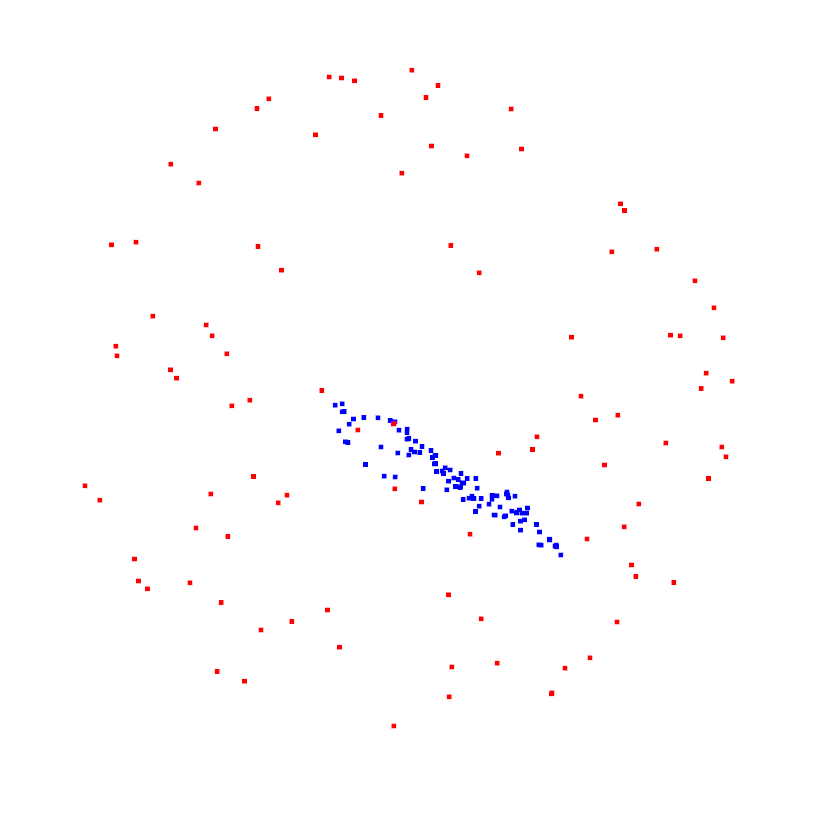

HEADER My ML research development environment workflow

# My ML research development environment workflow

_TL;DR: Build a docker image, mount your code as a volume, live a happy life._

As a CS PhD student doing machine learning research, I usually have multiple projects going at once. These projects require different versions of libraries (e.g. PyTorch) or system setups (e.g. CUDA versions), so they cannot conflict with each other. I do development locally, but run most train and test jobs on the compute cluster, so I need consistency between the two, with different dataset locations handled at the environment level, not the client code level. These environments are also regularly subject to change; a package needs to be easy to add or update without being left in a broken state (e.g. due to bad uninstall routine), and if the env is broken, it's easy to roll back to a working one. Once changed, they need to be easy to synchronize with other systems without a painful rebuild process or the possibility of one system being left in a broken state. I also want the environments to be scrutable; the descriptions of how they were constructed need to be human readable and tracked by source control.

I need environments that are:

1. Self-contained -- no implicit system dependencies
2. Easy to distribute -- pull a binary image from an authoritative source
3. Self-describing -- script under source control to recreate the image from scratch or modify it for future needs
4. Checkpointed -- no doing a from scratch rebuild of the env because of a single bad command
5. File-system mappable -- inside the environment, everything needs to appear in a standard location on disk, even if the underlying filesystem stores the data in different folders

For these reasons, I do all of my development work inside Docker containers.

## Intro to Docker

Docker is a system for building and running _containers_. Each container holds a full system image -- you start with a base system image (e.g. [an Ubuntu image with CUDA and OpenGL preinstalled](https://hub.docker.com/r/nvidia/cudagl)), and then you modify it via a series of `bash` commands laid out in a `Dockerfile`. Once the container image is built, you can interactively run programs (such as your code) inside using the installed libraries. Your code and other folders such as data folders can be dynamically mounted into the container, allowing for live editing of your code from either inside the container, or outside on the base system (e.g. from an open text editor). Built images can be uploaded to [DockerHub](https://hub.docker.com/), where they can be pulled down to another machine (e.g. the compute cluster), ensuring binary identical environments.

The following steps assume that you have `docker` installed on your base system with NVidia GPU support (sometimes called `nvidia-docker2`), and your base system has an NVidia GPU with a GPU _driver_ with CUDA version support at _least_ as great as your targeted CUDA version. **Note:** driver CUDA support is _not_ the same as having CUDA installed on your base system. You can check the version of CUDA your driver supports with the output `nvidia-smi`, e.g.

```
$ nvidia-smi
+-----------------------------------------------------------------------------+
| NVIDIA-SMI 525.116.04   Driver Version: 525.116.04   CUDA Version: 12.0     |
|-------------------------------+----------------------+----------------------+

```

means the base system supports CUDA versions 12.0 and earlier (including CUDA 11.X and 10.X)

### The `Dockerfile`

[Below is the `Dockerfile` I base my environments upon](https://github.com/kylevedder/kylevedder.github.io/blob/master/misc/research_dev_env/docker/Dockerfile) --- it uses an NVidia provided base image with CUDA 11.3 and OpenGL on Ubuntu 20.04. The `Dockerfile` performs some system setup, then installs `miniconda` (a minimal installer for the commonly used `conda` package manager), which it uses to install other standard packages: Python 3.10, PyTorch 1.12.1, and Open3D 0.17.


```
INCLUDE ./research_dev_env/docker/Dockerfile
```

To build this `Dockerfile` inside the [example project folder](https://github.com/kylevedder/kylevedder.github.io/tree/master/misc/research_dev_env), run

```
docker build docker/ -t research_dev_env
```

This command uses the `docker/` subfolder as a build context, meaning the build process has access to all files inside the folder (e.g. to `COPY` into the image, in the case of `docker/bashrc`), and defaults to using the file named `Dockerfile` inside this context. The built container is tagged as `research_dev_env` with the `-t` flag.

### Pushing the container to DockerHub

To make the container distributable to any system, I created [an example repo under my account on DockerHub](https://hub.docker.com/repository/docker/kylevedder/research_dev_env). Note that the commands below are for my account, and require you to have authenticated your DockerHub account (i.e. via `docker login`).

To tag the locally built image with the remote repo:

```
docker image tag research_dev_env kylevedder/research_dev_env
```

To push:

```
docker image push kylevedder/research_dev_env
```

### Running in the container locally

I use the following bash script to run an interactive session in the container (`kylevedder/research_dev_env:latest`):

```
INCLUDE ./research_dev_env/launch.sh
```

this script enables everything we want inside the container, including interactive sessions (`-it`), access to all system GPUS (`--gpus=all`), mounting our codebase as `/project` inside the container, setting the persistent bash history file, and preparing X11 for headed viewing (a shockingly non-trivial endeavor to setup).

Upon launch, you're given a bash session located in `/project` that lets you run your code; the demo program `visualize.py` maps a random unit sphere point cloud through a randomly initialized two layer MLP, producing a mapped sphere; the results are interactively visualized in 3D with Open3d, with the input shown in red and the result shown in blue.

 


### Running the container on a cluster

Docker requires root access to run and makes changes on the mounted file system as root. This is fine for your local development machine, but is dangerous in a shared cluster.

Penn's SLURM cluster supports running inside containers by converting them from traditional container/OS images into unprivileged sandboxes (using NVidia's [`enroot`](https://github.com/NVIDIA/enroot)) and then running those sandboxes (using NVidia's [`pyxis`](https://github.com/NVIDIA/pyxis)).

#### Creating a `.sqsh` file with `enroot`

`enroot` creates a `.sqsh` file, a self-contained sandbox image of your docker container. To do this on a SLURM cluster using `srun`, run

```
srun enroot import docker://kylevedder/research_dev_env:latest
```

which will produce a `kylevedder+research_dev_env+latest.sqsh` file in the directory the `srun` command was launched in

#### Running a job using a `.sqsh` file

The `pyxis` plugin allows for `.sqsh` files to be used as containers. An example `srun` job using this container

```
srun --container-image=/home/kvedder/kylevedder+research_dev_env+latest.sqsh --container-mounts=/home/kvedder/my_dataset:/dataset/,/home/kvedder/code/my_project:/project  bash -c "python my_job.py"
```

This will run `python my_job.py` in the container using the codebase `/home/kvedder/code/my_project` mounted to `/project`, and have access to `/home/kvedder/my_dataset` mounted at `/dataset`. Further mounts can be added with the same comma separated syntax.


## FAQ

### Why not just use `conda` environment files?

`conda` environment files are **NOT** fully reproducible; many packages have implicit dependencies on underlying system packages. Even if they have no underlying system dependencies, `conda` environments can still fail to be reproduced if a single package at the pegged version becomes unavailable (e.g. deprecation). Docker images are fully self-contained, meaning at any point in the future the environment can be pulled and it will be _binary_ equivalent to the environment used to develop and test for your paper.

`conda` environments are also easy to break --- uninstalling or upgrading a package can require a full environment rebuild, and when testing package versions for issues, there's not a good way to go back to a "known good" state. Docker images provide known, deterministic state, along with a build cache for easy switching between line configurations.

 
`environment.yml` files are also inscrutable, as they do not distinguish between packages intentionally installed versus implicitly installed. They are also difficult to keep synchronized between systems, as it requires either fully rebuilding the environment each time it's updated, or risk desynchronization because of faulty package uninstall logic.

### Docker is too _complicated_

This isn't a question, and I find editing a `Dockerfile` and rebuilding to be 100x less frustrating than futzing around with a `conda` environment during package version management. I have had to wipe and rebuild `conda` environments at least 50 times because something broke during an edit while trying to resolve multi-package compatibility issues. Docker's ability to revert to a known good state has saved me more times than I can count.