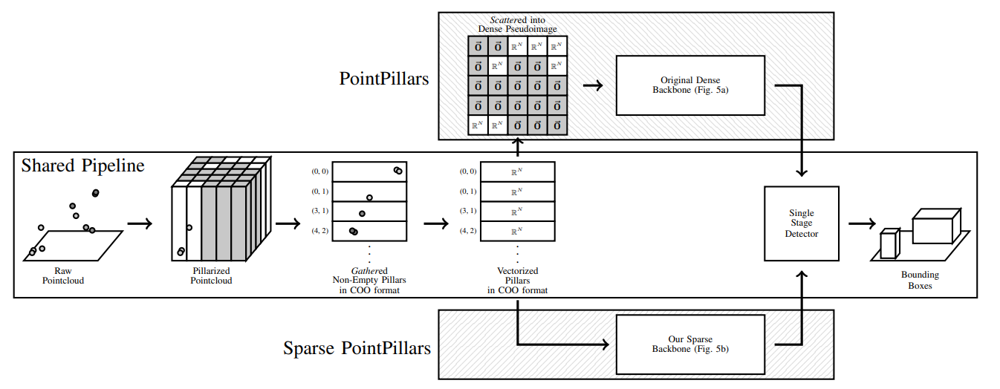
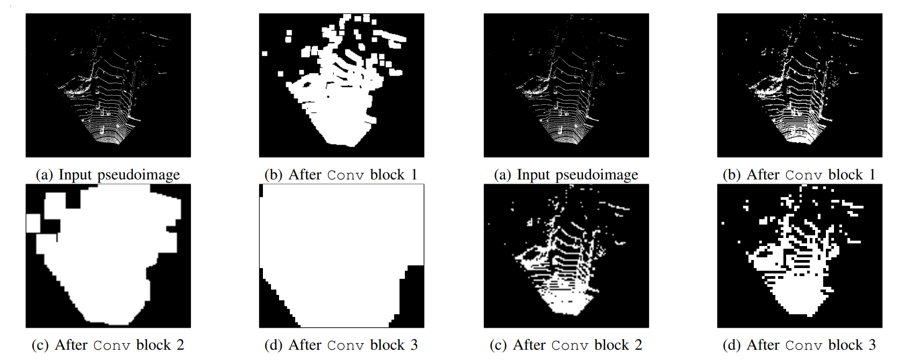

HEADER Sparse Point Pillars

# Sparse PointPillars: Maintaining and Exploiting Input Sparsity to Improve Runtime on Embedded Systems

## [Kyle Vedder](http://vedder.io) and [Eric Eaton](https://www.seas.upenn.edu/~eeaton/)

## Abstract:

Bird's Eye View (BEV) is a popular representation for processing 3D point clouds, and by its nature is fundamentally sparse. Motivated by the computational limitations of mobile robot platforms, we create a fast, high-performance BEV 3D object detector that maintains and exploits this input sparsity to decrease runtimes over non-sparse baselines and avoids the tradeoff between pseudoimage area and runtime. We present results on KITTI, a canonical 3D detection dataset, and Matterport-Chair, a novel Matterport3D-derived chair detection dataset from scenes in real furnished homes. We evaluate runtime characteristics using a desktop GPU, an embedded ML accelerator, and a robot CPU, demonstrating that our method results in significant detection speedups (2X or more) for embedded systems with only a modest decrease in detection quality. Our work represents a new approach for practitioners to optimize models for embedded systems by maintaining and exploiting input sparsity throughout their entire pipeline to reduce runtime and resource usage while preserving detection performance.

## Key Insights:

PointPillars, a popular 3D object detector, consumes a pointcloud, converts its sparse set of non-empty pillars into a sparse COO matrix format, vectorizes these pillars, then converts back to a dense matrix to run its dense convolutional Backbone. In improving runtimes for Sparse PointPillars, our first key insight is we can leave the vectorized matrix in its sparse format and _exploit_ this sparsity in our Backbone, allowing us to skip computation in empty regions of the pseudoimage.



Our second key insight is that we want to _maintain_ this sparsity to ensure successive layers of the Backbone are also efficient. We do this via our new Backbone which utilizes carefully placed sparse and submanifold convolutions. Left image shows the PointPillars' dense Backbone pseudoimage smearing, right shows our sparse Backbone's sparsity preservation.



Full details on the Backbone design plus ablative studies are available in the paper.

## Results Overview:

On our custom realistic service robot object detection benchmark, Matterport-Chair, we found that

 - Sparse PointPillars outperforms PointPillars on a Jetson Xavier on max power mode by ~2X
 - Sparse PointPillars outperforms PointPillars on a Jetson Xavier on min power mode by ~3X
 - Sparse PointPillars on a Jetson Xavier on min power mode is slightly faster than PointPillars on a Jetson Xavier on max power (saves 3X as much power!)
 - Sparse PointPillars outperforms PointPillars on a robot CPU by >4x

All of this comes at the cost of 6% AP on the BEV benchmark and 4% AP on the 3D box benchmark.

Full experimental details, plus comparisons on KITTI, are available in the paper.

## Full Paper and Downloadables: 

[[Accepted IROS 2022 Paper PDF]](publications/sparse_point_pillars_iros_2022.pdf)

### Citation:

```
BIB bibs/conferences.bib vedder2022sparse
```
  
#### Code: 

[https://github.com/kylevedder/SparsePointPillars](https://github.com/kylevedder/SparsePointPillars) 

#### Model weights:

 - [[matterport_chair_sparse]](https://drive.google.com/file/d/1f5qGC3NiokMBIrW40_0QJE0PuqWJ9VvK/view?usp=sharing)
 - [[matterport_chair_dense]](https://drive.google.com/file/d/13tB9siL1-kTWDNuES79oRVkNdQQukFWD/view?usp=sharing)
 - [[kitti_sparse]](https://drive.google.com/file/d/1zUYiaWDTY0V_kR7xtvGxNK0BE005PSh_/view?usp=sharing)
 - [[kitti_dense]](https://drive.google.com/file/d/1TArZ3dx_rydSsgnNMq3UBs6-7k3B2vhD/view?usp=sharing)
 - [[kitti_sparse1_dense23]](https://drive.google.com/file/d/1eCvUPQLki7C5nfBa6H0MCg--G8Pqhqbz/view?usp=sharing)
 - [[kitti_sparse12_dense3]](https://drive.google.com/file/d/1SJnSuYAvwXE2kBburyp1L30GzEGmY0hu/view?usp=sharing)
 - [[kitti_sparse_wide]](https://drive.google.com/file/d/1Fc7_DDrYlHKXoCwpVeaSOuMv7QgXPVZ6/view?usp=sharing)

#### _Matterport-Chair_ dataset:
  
  - [[Train split]](https://drive.google.com/file/d/1klZencIH6NiDc6yqlpuD9z5KL8HYfy09/view?usp=sharing)
  - [[Test split]](https://drive.google.com/file/d/1xkJWe5PQi-F6LMHNOuK3TeKrnvqtPc0P/view?usp=sharing)

_Matterport-Chair_ was generated using [MatterportDataSampling](https://github.com/kylevedder/MatterportDataSampling), our utility for generating supervised object detection datasets from Matterport3D.

## Videos:

Invited talk at the [3D-Deep Learning for Automated Driving](https://sites.google.com/view/3d-dlad-v4-iv2022/home) workshop of IEEE Intelligent Vehicles Symposium 2022:

<iframe width="560" height="315" src="https://www.youtube.com/embed/JgcR6cFXR5w" title="YouTube video player" frameborder="0" allow="accelerometer; autoplay; clipboard-write; encrypted-media; gyroscope; picture-in-picture" allowfullscreen></iframe>

One Minute Overview Video:

<iframe width="560" height="315" src="https://www.youtube.com/embed/3OlLm8FZxDY" title="YouTube video player" frameborder="0" allow="accelerometer; autoplay; clipboard-write; encrypted-media; gyroscope; picture-in-picture" allowfullscreen></iframe>

Three Minute Overview Video:

<iframe width="560" height="315" src="https://www.youtube.com/embed/zuLboHg3GLA" title="YouTube video player" frameborder="0" allow="accelerometer; autoplay; clipboard-write; encrypted-media; gyroscope; picture-in-picture" allowfullscreen></iframe>
