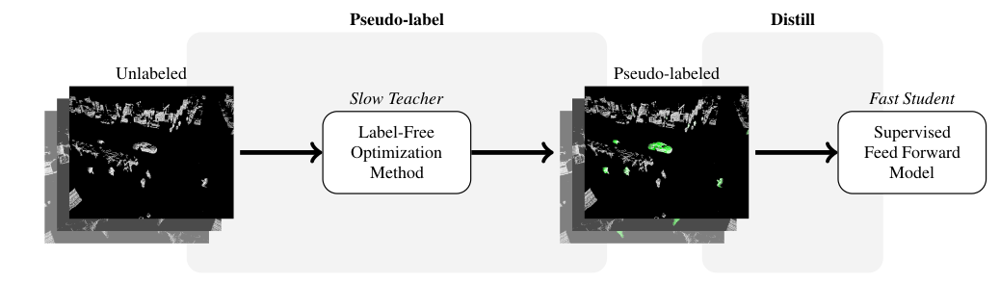
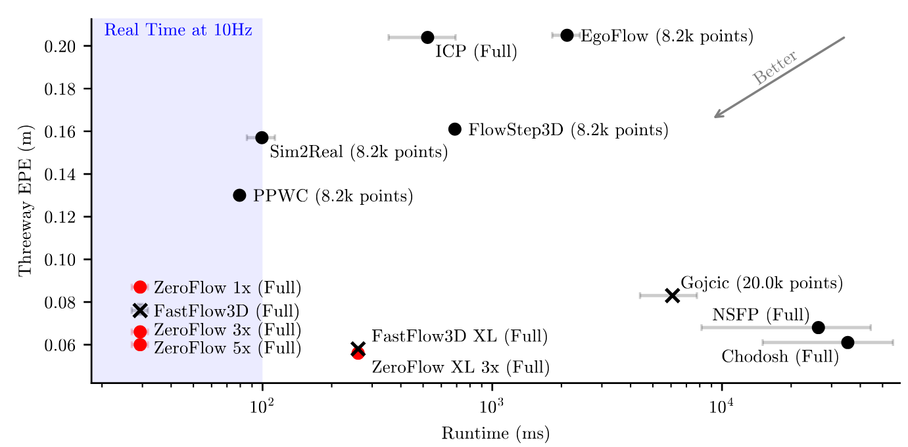
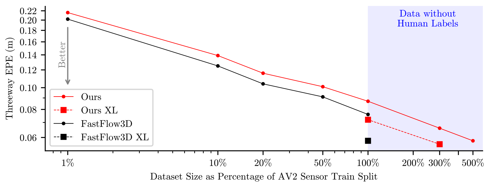

HEADER ZeroFlow: Scalable Scene Flow via Distillation

# ZeroFlow: Scalable Scene Flow via Distillation

## [Kyle Vedder](http://vedder.io), [Neehar Peri](http://www.neeharperi.com/), [Nathaniel Chodosh](https://scholar.google.com/citations?user=b4qKr7gAAAAJ&hl=en), [Ishan Khatri](https://ishan.khatri.io/), [Eric Eaton](https://www.seas.upenn.edu/~eeaton/), [Dinesh Jayaraman](https://www.seas.upenn.edu/~dineshj/), [Yang Liu](https://youngleox.github.io/), [Deva Ramanan](https://www.cs.cmu.edu/~deva/), and [James Hays](https://faculty.cc.gatech.edu/~hays/)

## News:

_Jul 28th, 2023_: We scaled up the ZeroFlow pipeline on additional point clouds from the unlabeled Argoverse 2 LiDAR dataset. With 3x the data, we beat the supervised baseline and teacher performance; with 3x the data and a bigger backbone, we are **state-of-the-art** on the [Argoverse 2 Self-Supervised Scene Flow Leaderboard](https://eval.ai/web/challenges/challenge-page/2010/leaderboard/4759)! Scaling ZeroFlow on raw data logs is all you need to build state-of-the-art scene flow methods --- **AV companies should try this on their internal logs!**

_Jun 18th, 2023_: ZeroFlow was selected as a **highlighted method** in the CVPR 2023 _Workshop on Autonomous Driving_ [Scene Flow Challenge](https://eval.ai/web/challenges/challenge-page/2010/overview)!

## Abstract:

Scene flow estimation is the task of describing the 3D motion field between temporally successive point clouds. State-of-the-art methods use strong priors and test-time optimization techniques, but require on the order of tens of seconds to process large-scale point clouds, making them unusable as computer vision primitives for real-time applications such as open world object detection. Feed forward methods are considerably faster, running on the order of tens to hundreds of milliseconds for large-scale point clouds, but require expensive human supervision. To address both limitations, we propose _Scene Flow via Distillation_, a simple, scalable distillation framework that uses a label-free optimization method to produce pseudo-labels to supervise a feed forward model. Our instantiation of this framework, _ZeroFlow_, achieves **state-of-the-art** performance on the _Argoverse 2 Self-Supervised Scene Flow Challenge_ while using zero human labels by simply training on large-scale, diverse unlabeled data. At test-time, ZeroFlow is over 1000$\times$ faster than label-free state-of-the-art optimization-based methods on large-scale point clouds and over 1000$\times$ cheaper to train on unlabeled data compared to the cost of human annotation. To facilitate further research, we will release our code, trained model weights, and high quality pseudo-labels for the Argoverse 2 and Waymo Open datasets.

## Key Insights:

Existing scene flow estimation methods are either slow but label free test-time optimization methods, or fast but human supervised feed forward networks. We construct the _Scene Flow via Distillation_ framework to break this tradeoff.

Our straight-forward instantiation of this in ZeroFlow shows that simply training a supervised model with imperfect pseudo-labels can exceed the performance of perfect human labels on substantial fraction of the data. We think this is itself surprising, but we also think it has highly impactful implications for the problem of scene flow estimation: point cloud quantity and diversity is more important than perfect flow label quality for training feed forward scene flow estimators.




We instantiate this framework in _ZeroFlow_, a scene flow method that scales to real world point clouds. ZeroFlow uses Neural Scene Flow Prior, a high quality label-free optimization method, to generate pseudolabels to train FastFlow3D, a fast, scalable feed forward scene flow network. The resulting method is real-time and produces state-of-the-art quality flows with _zero_ human labels.





## Full Paper and Downloads: 

[[Preprint PDF]](https://arxiv.org/abs/2305.10424)

[[Official Code]](https://github.com/kylevedder/zeroflow)

[[Model Weights]](https://github.com/kylevedder/zeroflow_weights)

[Videos]: Forthcoming

### Citation:

```
BIB bibs/conferences.bib vedder2023zeroflow
```

